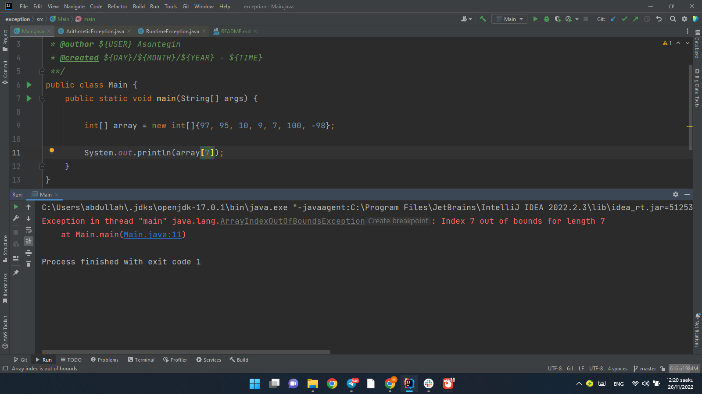

* ### ArithmeticException 
* ### NullPointerException 
* ### ArrayIndexOutOfBoundsException 

### ___________________________________________________________________________________________________

* ### java.io
**java.io** - бул жалпысынан кээ бир маалымат окуу жана жазуу үчүн иштелип чыккан класстарды жана интерфейстерди чогултуучу пакет.

**java.io** - это пакет, в котором собранны классы и интерфейсы, которые предназначенны, если обобщить, для чтения и записи информации из/в какой- либо источник, например файл.

* **File классы** - бул файлга же папкага баруучу жолдун абстракттуу көрүнүшү.

* **FileInputStream** классы булактан маалыматты окуй турган агымды түзүү үчүн иштелип чыккан.

* **FileOutputStream** классы булакка маалымат жаза турган агымды түзүү үчүн иштелип чыккан.

* **FileInputStream** жана **FileOutputStream** класстарынын конструкторлору **FileNotFoundException** ыргыта алышат.

*  **Класс File** - абстрактная репрезентация пути к файлу или папке.

* Класс **FilelnputStream** предназначен для создания потока, с помощью которого можно читать информацию из источника.

* Класс **FileOutputStream** предназначен для создания потока, с помощью которого можно писать информацию в источник.

* Конструкторы классов **FilelnputStream** и **FileOutputStream** могут выбрасывать исключение **FileNotFoundException**.

